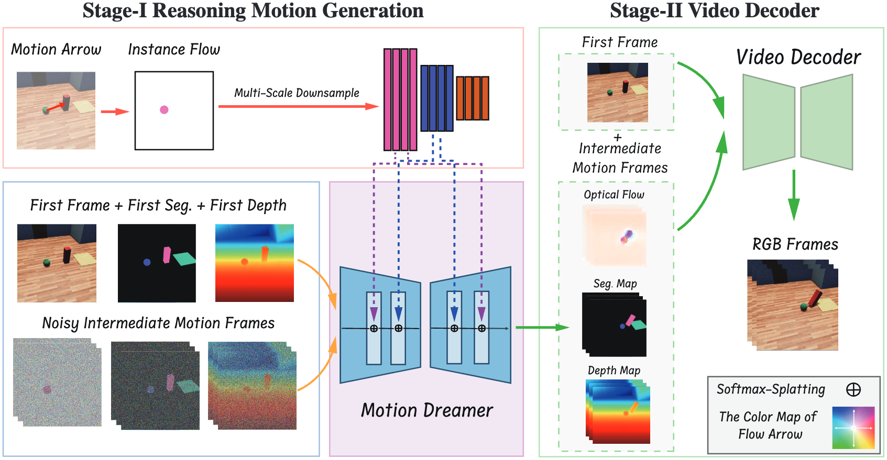

# Motion Dreamer: Realizing Physically Coherent Video Generation through Scene-Aware Motion Reasoning

We introduce Motion Dreamer, a two-stage video generation framework that decouples motion reasoning from high-fidelity video synthesis, addressing the challenge of producing physically coherent videos.

## Overview

## TODO

| Tasks |     Status    |
|---------------------------------------|---------------|
| Release the collected driving data     | [ ] |
| Release training/evaluation code       | [ ] |
| Release the official model             | [ ] |

